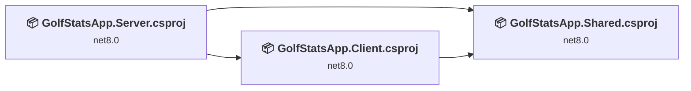
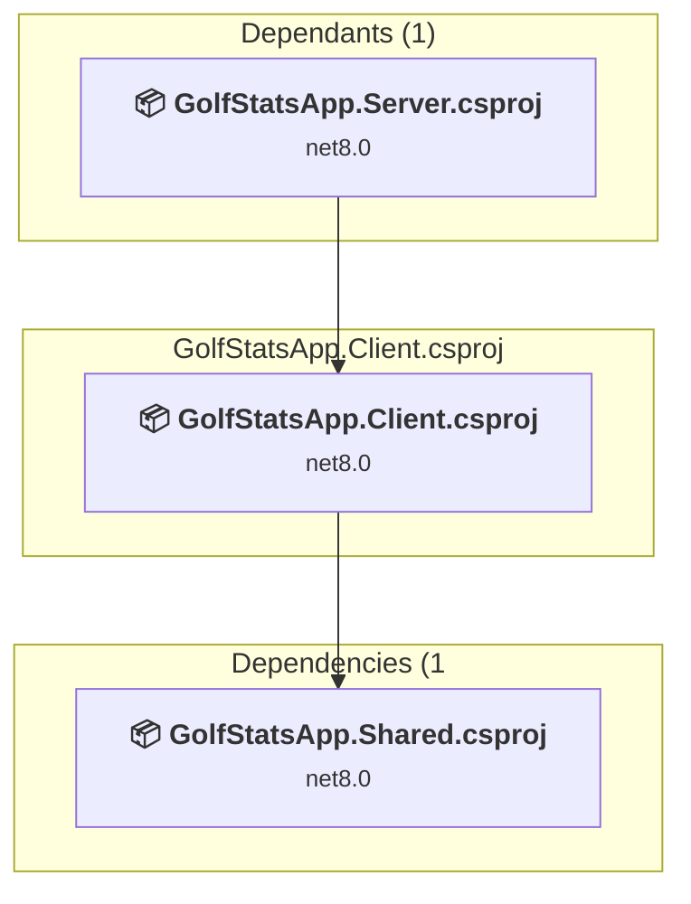
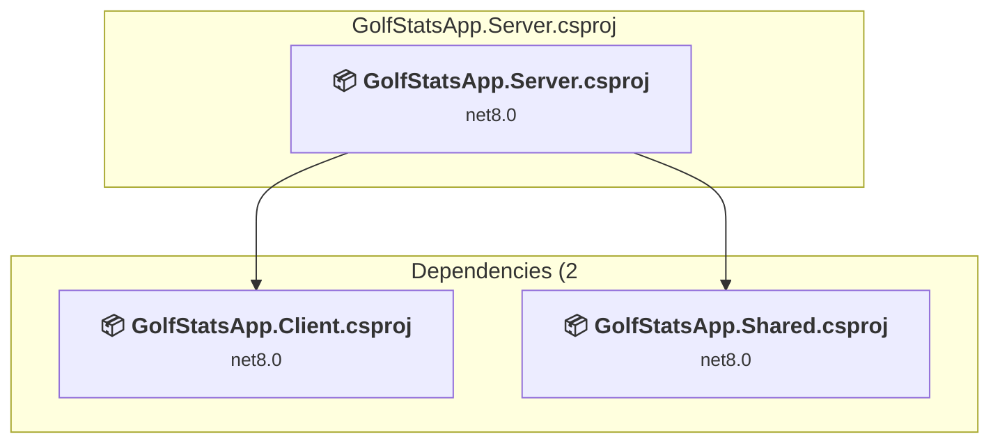
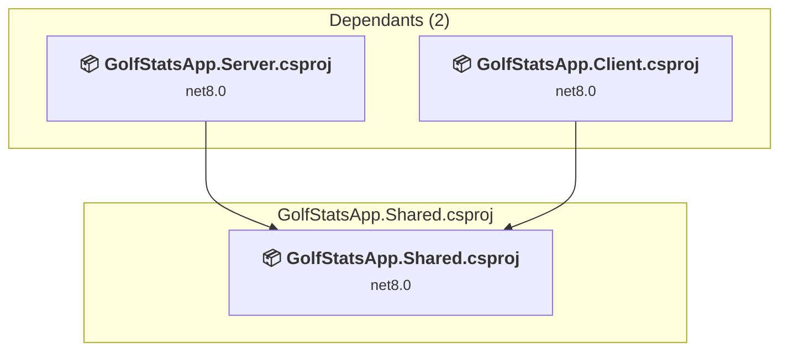

# Projects and dependencies analysis

This document provides a comprehensive overview of the projects and their dependencies in the context of upgrading to .NETCoreApp,Version=v10.0.

## Table of Contents

- [Executive Summary](#executive-Summary)
  - [Highlevel Metrics](#highlevel-metrics)
  - [Projects Compatibility](#projects-compatibility)
  - [Package Compatibility](#package-compatibility)
  - [API Compatibility](#api-compatibility)
  - [Binding Redirect Configuration](#binding-redirect-configuration)
- [Aggregate NuGet packages details](#aggregate-nuget-packages-details)
- [Top API Migration Challenges](#top-api-migration-challenges)
  - [Technologies and Features](#technologies-and-features)
  - [Most Frequent API Issues](#most-frequent-api-issues)
- [Projects Relationship Graph](#projects-relationship-graph)
- [Project Details](#project-details)

  - [Client\GolfStatsApp.Client.csproj](#clientgolfstatsappclientcsproj)
  - [Server\GolfStatsApp.Server.csproj](#servergolfstatsappservercsproj)
  - [Shared\GolfStatsApp.Shared.csproj](#sharedgolfstatsappsharedcsproj)

## Executive Summary

### Highlevel Metrics

| Metric | Count | Status |
| :--- | :---: | :--- |
| Total Projects | 3 | All require upgrade |
| Total NuGet Packages | 61 | 6 need upgrade |
| Total Code Files | 11 |  |
| Total Code Files with Incidents | 6 |  |
| Total Lines of Code | 903 |  |
| Total Number of Issues | 15 |  |
| Estimated LOC to modify | 6+ | at least 0.7% of codebase |

### Projects Compatibility

| Project | Target Framework | Difficulty | Package Issues | API Issues | Binding Issues | Est. LOC Impact | Description |
| :--- | :---: | :---: | :---: | :---: | :---: | :---: | :--- |
| [Client\GolfStatsApp.Client.csproj](#clientgolfstatsappclientcsproj) | net8.0 | 🟢 Low | 4 | 5 | 0 | 5+ | AspNetCore, Sdk Style = True |
| [Server\GolfStatsApp.Server.csproj](#servergolfstatsappservercsproj) | net8.0 | 🟢 Low | 2 | 1 | 0 | 1+ | AspNetCore, Sdk Style = True |
| [Shared\GolfStatsApp.Shared.csproj](#sharedgolfstatsappsharedcsproj) | net8.0 | 🟢 Low | 0 | 0 | 0 |  | ClassLibrary, Sdk Style = True |

### Package Compatibility

| Status | Count | Percentage |
| :--- | :---: | :---: |
| ✅ Compatible | 55 | 90.2% |
| ⚠️ Incompatible | 0 | 0.0% |
| 🔄 Upgrade Recommended | 6 | 9.8% |
| ***Total NuGet Packages*** | ***61*** | ***100%*** |

### API Compatibility

| Category | Count | Impact |
| :--- | :---: | :--- |
| 🔴 Binary Incompatible | 0 | High - Require code changes |
| 🟡 Source Incompatible | 0 | Medium - Needs re-compilation and potential conflicting API error fixing |
| 🔵 Behavioral change | 6 | Low - Behavioral changes that may require testing at runtime |
| ✅ Compatible | 3127 |  |
| ***Total APIs Analyzed*** | ***3133*** |  |

## Aggregate NuGet packages details

| Package | Current Version | Suggested Version | Projects | Description |
| :--- | :---: | :---: | :--- | :--- |
| Humanizer.Core | 2.14.1 |  | [GolfStatsApp.Server.csproj](#servergolfstatsappservercsproj) | ✅Compatible |
| Microsoft.AspNetCore.Authorization | 8.0.8 |  | [GolfStatsApp.Client.csproj](#clientgolfstatsappclientcsproj) [GolfStatsApp.Server.csproj](#servergolfstatsappservercsproj) | ✅Compatible |
| Microsoft.AspNetCore.Components | 8.0.8 |  | [GolfStatsApp.Client.csproj](#clientgolfstatsappclientcsproj) [GolfStatsApp.Server.csproj](#servergolfstatsappservercsproj) | ✅Compatible |
| Microsoft.AspNetCore.Components.Analyzers | 8.0.8 |  | [GolfStatsApp.Client.csproj](#clientgolfstatsappclientcsproj) [GolfStatsApp.Server.csproj](#servergolfstatsappservercsproj) | ✅Compatible |
| Microsoft.AspNetCore.Components.Forms | 8.0.8 |  | [GolfStatsApp.Client.csproj](#clientgolfstatsappclientcsproj) [GolfStatsApp.Server.csproj](#servergolfstatsappservercsproj) | ✅Compatible |
| Microsoft.AspNetCore.Components.Web | 8.0.8 |  | [GolfStatsApp.Client.csproj](#clientgolfstatsappclientcsproj) [GolfStatsApp.Server.csproj](#servergolfstatsappservercsproj) | ✅Compatible |
| Microsoft.AspNetCore.Components.WebAssembly | 8.0.8 | 10.0.12 | [GolfStatsApp.Client.csproj](#clientgolfstatsappclientcsproj) [GolfStatsApp.Server.csproj](#servergolfstatsappservercsproj) | NuGet package upgrade is recommended |
| Microsoft.AspNetCore.Components.WebAssembly.DevServer | 8.0.8 | 10.0.12 | [GolfStatsApp.Client.csproj](#clientgolfstatsappclientcsproj) | NuGet package upgrade is recommended |
| Microsoft.AspNetCore.Components.WebAssembly.Server | 8.0.8 | 10.0.12 | [GolfStatsApp.Server.csproj](#servergolfstatsappservercsproj) | NuGet package upgrade is recommended |
| Microsoft.AspNetCore.Metadata | 8.0.8 |  | [GolfStatsApp.Client.csproj](#clientgolfstatsappclientcsproj) [GolfStatsApp.Server.csproj](#servergolfstatsappservercsproj) | ✅Compatible |
| Microsoft.Bcl.AsyncInterfaces | 6.0.0 |  | [GolfStatsApp.Server.csproj](#servergolfstatsappservercsproj) | ✅Compatible |
| Microsoft.CodeAnalysis.Analyzers | 3.3.3 |  | [GolfStatsApp.Server.csproj](#servergolfstatsappservercsproj) | ✅Compatible |
| Microsoft.CodeAnalysis.Common | 4.5.0 |  | [GolfStatsApp.Server.csproj](#servergolfstatsappservercsproj) | ✅Compatible |
| Microsoft.CodeAnalysis.CSharp | 4.5.0 |  | [GolfStatsApp.Server.csproj](#servergolfstatsappservercsproj) | ✅Compatible |
| Microsoft.CodeAnalysis.CSharp.Workspaces | 4.5.0 |  | [GolfStatsApp.Server.csproj](#servergolfstatsappservercsproj) | ✅Compatible |
| Microsoft.CodeAnalysis.Workspaces.Common | 4.5.0 |  | [GolfStatsApp.Server.csproj](#servergolfstatsappservercsproj) | ✅Compatible |
| Microsoft.EntityFrameworkCore | 8.0.8 |  | [GolfStatsApp.Server.csproj](#servergolfstatsappservercsproj) | ✅Compatible |
| Microsoft.EntityFrameworkCore.Abstractions | 8.0.8 |  | [GolfStatsApp.Server.csproj](#servergolfstatsappservercsproj) | ✅Compatible |
| Microsoft.EntityFrameworkCore.Analyzers | 8.0.8 |  | [GolfStatsApp.Server.csproj](#servergolfstatsappservercsproj) | ✅Compatible |
| Microsoft.EntityFrameworkCore.Design | 8.0.8 |  | [GolfStatsApp.Server.csproj](#servergolfstatsappservercsproj) | ✅Compatible |
| Microsoft.EntityFrameworkCore.Relational | 8.0.8 |  | [GolfStatsApp.Server.csproj](#servergolfstatsappservercsproj) | ✅Compatible |
| Microsoft.EntityFrameworkCore.Tools | 8.0.8 | 10.0.12 | [GolfStatsApp.Server.csproj](#servergolfstatsappservercsproj) | NuGet package upgrade is recommended |
| Microsoft.Extensions.Caching.Abstractions | 8.0.0 |  | [GolfStatsApp.Server.csproj](#servergolfstatsappservercsproj) | ✅Compatible |
| Microsoft.Extensions.Caching.Memory | 8.0.0 |  | [GolfStatsApp.Server.csproj](#servergolfstatsappservercsproj) | ✅Compatible |
| Microsoft.Extensions.Configuration | 8.0.0 |  | [GolfStatsApp.Client.csproj](#clientgolfstatsappclientcsproj) [GolfStatsApp.Server.csproj](#servergolfstatsappservercsproj) | ✅Compatible |
| Microsoft.Extensions.Configuration.Abstractions | 8.0.0 |  | [GolfStatsApp.Client.csproj](#clientgolfstatsappclientcsproj) [GolfStatsApp.Server.csproj](#servergolfstatsappservercsproj) | ✅Compatible |
| Microsoft.Extensions.Configuration.Binder | 8.0.2 |  | [GolfStatsApp.Client.csproj](#clientgolfstatsappclientcsproj) [GolfStatsApp.Server.csproj](#servergolfstatsappservercsproj) | ✅Compatible |
| Microsoft.Extensions.Configuration.FileExtensions | 8.0.0 |  | [GolfStatsApp.Client.csproj](#clientgolfstatsappclientcsproj) [GolfStatsApp.Server.csproj](#servergolfstatsappservercsproj) | ✅Compatible |
| Microsoft.Extensions.Configuration.Json | 8.0.0 |  | [GolfStatsApp.Client.csproj](#clientgolfstatsappclientcsproj) [GolfStatsApp.Server.csproj](#servergolfstatsappservercsproj) | ✅Compatible |
| Microsoft.Extensions.DependencyInjection | 8.0.0 |  | [GolfStatsApp.Client.csproj](#clientgolfstatsappclientcsproj) [GolfStatsApp.Server.csproj](#servergolfstatsappservercsproj) | ✅Compatible |
| Microsoft.Extensions.DependencyInjection.Abstractions | 8.0.1 |  | [GolfStatsApp.Client.csproj](#clientgolfstatsappclientcsproj) [GolfStatsApp.Server.csproj](#servergolfstatsappservercsproj) | ✅Compatible |
| Microsoft.Extensions.DependencyModel | 8.0.1 |  | [GolfStatsApp.Server.csproj](#servergolfstatsappservercsproj) | ✅Compatible |
| Microsoft.Extensions.FileProviders.Abstractions | 8.0.0 |  | [GolfStatsApp.Client.csproj](#clientgolfstatsappclientcsproj) [GolfStatsApp.Server.csproj](#servergolfstatsappservercsproj) | ✅Compatible |
| Microsoft.Extensions.FileProviders.Physical | 8.0.0 |  | [GolfStatsApp.Client.csproj](#clientgolfstatsappclientcsproj) [GolfStatsApp.Server.csproj](#servergolfstatsappservercsproj) | ✅Compatible |
| Microsoft.Extensions.FileSystemGlobbing | 8.0.0 |  | [GolfStatsApp.Client.csproj](#clientgolfstatsappclientcsproj) [GolfStatsApp.Server.csproj](#servergolfstatsappservercsproj) | ✅Compatible |
| Microsoft.Extensions.Logging | 8.0.0 |  | [GolfStatsApp.Client.csproj](#clientgolfstatsappclientcsproj) [GolfStatsApp.Server.csproj](#servergolfstatsappservercsproj) | ✅Compatible |
| Microsoft.Extensions.Logging.Abstractions | 8.0.1 |  | [GolfStatsApp.Client.csproj](#clientgolfstatsappclientcsproj) [GolfStatsApp.Server.csproj](#servergolfstatsappservercsproj) | ✅Compatible |
| Microsoft.Extensions.Options | 8.0.2 |  | [GolfStatsApp.Client.csproj](#clientgolfstatsappclientcsproj) [GolfStatsApp.Server.csproj](#servergolfstatsappservercsproj) | ✅Compatible |
| Microsoft.Extensions.Primitives | 8.0.0 |  | [GolfStatsApp.Client.csproj](#clientgolfstatsappclientcsproj) [GolfStatsApp.Server.csproj](#servergolfstatsappservercsproj) | ✅Compatible |
| Microsoft.JSInterop | 8.0.8 |  | [GolfStatsApp.Client.csproj](#clientgolfstatsappclientcsproj) [GolfStatsApp.Server.csproj](#servergolfstatsappservercsproj) | ✅Compatible |
| Microsoft.JSInterop.WebAssembly | 8.0.8 |  | [GolfStatsApp.Client.csproj](#clientgolfstatsappclientcsproj) [GolfStatsApp.Server.csproj](#servergolfstatsappservercsproj) | ✅Compatible |
| Microsoft.NET.ILLink.Tasks | 8.0.31 | 10.0.12 | [GolfStatsApp.Client.csproj](#clientgolfstatsappclientcsproj) | NuGet package upgrade is recommended |
| Microsoft.NET.Sdk.WebAssembly.Pack | 10.0.12 |  | [GolfStatsApp.Client.csproj](#clientgolfstatsappclientcsproj) | ✅Compatible |
| Mono.TextTemplating | 2.2.1 |  | [GolfStatsApp.Server.csproj](#servergolfstatsappservercsproj) | ✅Compatible |
| System.CodeDom | 4.4.0 |  | [GolfStatsApp.Server.csproj](#servergolfstatsappservercsproj) | ✅Compatible |
| System.Collections.Immutable | 6.0.0 |  | [GolfStatsApp.Server.csproj](#servergolfstatsappservercsproj) | ✅Compatible |
| System.Composition | 6.0.0 |  | [GolfStatsApp.Server.csproj](#servergolfstatsappservercsproj) | ✅Compatible |
| System.Composition.AttributedModel | 6.0.0 |  | [GolfStatsApp.Server.csproj](#servergolfstatsappservercsproj) | ✅Compatible |
| System.Composition.Convention | 6.0.0 |  | [GolfStatsApp.Server.csproj](#servergolfstatsappservercsproj) | ✅Compatible |
| System.Composition.Hosting | 6.0.0 |  | [GolfStatsApp.Server.csproj](#servergolfstatsappservercsproj) | ✅Compatible |
| System.Composition.Runtime | 6.0.0 |  | [GolfStatsApp.Server.csproj](#servergolfstatsappservercsproj) | ✅Compatible |
| System.Composition.TypedParts | 6.0.0 |  | [GolfStatsApp.Server.csproj](#servergolfstatsappservercsproj) | ✅Compatible |
| System.IO.Pipelines | 8.0.0 |  | [GolfStatsApp.Client.csproj](#clientgolfstatsappclientcsproj) [GolfStatsApp.Server.csproj](#servergolfstatsappservercsproj) | ✅Compatible |
| System.Net.Http.Json | 8.0.0 | 10.0.12 | [GolfStatsApp.Client.csproj](#clientgolfstatsappclientcsproj) [GolfStatsApp.Server.csproj](#servergolfstatsappservercsproj) | NuGet package upgrade is recommended |
| System.Reflection.Metadata | 6.0.1 |  | [GolfStatsApp.Server.csproj](#servergolfstatsappservercsproj) | ✅Compatible |
| System.Runtime.CompilerServices.Unsafe | 6.0.0 |  | [GolfStatsApp.Server.csproj](#servergolfstatsappservercsproj) | ✅Compatible |
| System.Text.Encoding.CodePages | 6.0.0 |  | [GolfStatsApp.Server.csproj](#servergolfstatsappservercsproj) | ✅Compatible |
| System.Text.Encodings.Web | 8.0.0 |  | [GolfStatsApp.Client.csproj](#clientgolfstatsappclientcsproj) [GolfStatsApp.Server.csproj](#servergolfstatsappservercsproj) | ✅Compatible |
| System.Text.Json | 8.0.0 |  | [GolfStatsApp.Client.csproj](#clientgolfstatsappclientcsproj) | ✅Compatible |
| System.Text.Json | 8.0.4 |  | [GolfStatsApp.Server.csproj](#servergolfstatsappservercsproj) | ✅Compatible |
| System.Threading.Channels | 6.0.0 |  | [GolfStatsApp.Server.csproj](#servergolfstatsappservercsproj) | ✅Compatible |

## Top API Migration Challenges

### Technologies and Features

| Technology | Issues | Percentage | Migration Path |
| :--- | :---: | :---: | :--- |

### Most Frequent API Issues

| API | Count | Percentage | Category |
| :--- | :---: | :---: | :--- |
| T:System.Net.Http.HttpContent | 2 | 33.3% | Behavioral Change |
| T:System.Uri | 2 | 33.3% | Behavioral Change |
| M:System.Uri.#ctor(System.String) | 1 | 16.7% | Behavioral Change |
| M:Microsoft.AspNetCore.Builder.ExceptionHandlerExtensions.UseExceptionHandler(Microsoft.AspNetCore.Builder.IApplicationBuilder,System.String) | 1 | 16.7% | Behavioral Change |

## Projects Relationship Graph

Legend:
📦 SDK-style project
⚙️ Classic project

## Project Details

### Client\GolfStatsApp.Client.csproj

#### Project Info

- **Current Target Framework:** net8.0
- **Proposed Target Framework:** net10.0
- **SDK-style**: True
- **Project Kind:** AspNetCore
- **Dependencies**: 1
- **Dependants**: 1
- **Number of Files**: 23
- **Number of Files with Incidents**: 3
- **Lines of Code**: 12
- **Estimated LOC to modify**: 5+ (at least 41.7% of the project)

#### Dependency Graph

Legend:
📦 SDK-style project
⚙️ Classic project

### API Compatibility

| Category | Count | Impact |
| :--- | :---: | :--- |
| 🔴 Binary Incompatible | 0 | High - Require code changes |
| 🟡 Source Incompatible | 0 | Medium - Needs re-compilation and potential conflicting API error fixing |
| 🔵 Behavioral change | 5 | Low - Behavioral changes that may require testing at runtime |
| ✅ Compatible | 1925 |  |
| ***Total APIs Analyzed*** | ***1930*** |  |

### Server\GolfStatsApp.Server.csproj

#### Project Info

- **Current Target Framework:** net8.0
- **Proposed Target Framework:** net10.0
- **SDK-style**: True
- **Project Kind:** AspNetCore
- **Dependencies**: 2
- **Dependants**: 0
- **Number of Files**: 10
- **Number of Files with Incidents**: 2
- **Lines of Code**: 799
- **Estimated LOC to modify**: 1+ (at least 0.1% of the project)

#### Dependency Graph

Legend:
📦 SDK-style project
⚙️ Classic project

### API Compatibility

| Category | Count | Impact |
| :--- | :---: | :--- |
| 🔴 Binary Incompatible | 0 | High - Require code changes |
| 🟡 Source Incompatible | 0 | Medium - Needs re-compilation and potential conflicting API error fixing |
| 🔵 Behavioral change | 1 | Low - Behavioral changes that may require testing at runtime |
| ✅ Compatible | 1032 |  |
| ***Total APIs Analyzed*** | ***1033*** |  |

### Shared\GolfStatsApp.Shared.csproj

#### Project Info

- **Current Target Framework:** net8.0
- **Proposed Target Framework:** net10.0
- **SDK-style**: True
- **Project Kind:** ClassLibrary
- **Dependencies**: 0
- **Dependants**: 2
- **Number of Files**: 3
- **Number of Files with Incidents**: 1
- **Lines of Code**: 92
- **Estimated LOC to modify**: 0+ (at least 0.0% of the project)

#### Dependency Graph

Legend:
📦 SDK-style project
⚙️ Classic project

### API Compatibility

| Category | Count | Impact |
| :--- | :---: | :--- |
| 🔴 Binary Incompatible | 0 | High - Require code changes |
| 🟡 Source Incompatible | 0 | Medium - Needs re-compilation and potential conflicting API error fixing |
| 🔵 Behavioral change | 0 | Low - Behavioral changes that may require testing at runtime |
| ✅ Compatible | 170 |  |
| ***Total APIs Analyzed*** | ***170*** |  |

